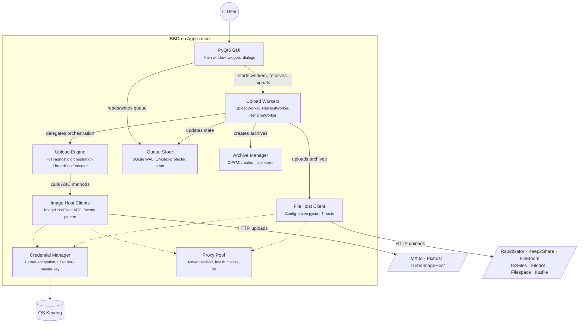

# Application components

This diagram shows the major components inside BBDrop and how they interact.
Each box represents a significant module or subsystem; arrows show the primary
communication paths.

## Component roles

- **PyQt6 GUI** (`src/gui/`) --- the main window (`BBDropGUI`, ~3500 lines),
  drag-and-drop queue table, settings dialogs, BBCode viewer, and system tray.
  Communicates with background workers exclusively through pyqtSignal/slot
  connections.

- **Upload Engine** (`src/core/engine.py`) --- the host-agnostic upload loop.
  Accepts any `ImageHostClient` implementation and runs parallel uploads via
  `ThreadPoolExecutor`. Uses `AtomicCounter` for thread-safe byte tracking
  across upload threads.

- **Queue Store** (`src/storage/database.py`, `src/storage/queue_manager.py`)
  --- SQLite database in WAL mode for concurrent readers. `QueueManager` wraps
  the store with `QMutex`-protected state transitions and pyqtSignal
  notifications for GUI updates.

- **Image Host Clients** (`src/network/`) --- the `ImageHostClient` ABC defines
  `upload_image()`, `normalize_response()`, and `get_default_headers()`. The
  factory (`image_host_factory.py`) returns the correct implementation based on
  host ID. `ImxToUploader` uses `requests`; `TurboImageHostClient` and
  `PixhostClient` use pycurl with thread-local handles.

- **File Host Client** (`src/network/file_host_client.py`) --- a single
  pycurl-based client that handles all 7 file hosts. Upload flow, auth method,
  and response parsing are configured declaratively via JSON files in
  `assets/hosts/`.

- **Upload Workers** (`src/processing/`) --- `QThread` subclasses that bridge
  the GUI and the engine. `UploadWorker` handles image host galleries,
  `FileHostWorker` handles file host uploads, and `RenameWorker` handles
  IMX-specific gallery renaming. All communicate results back to the GUI via
  pyqtSignal.

- **Credential Manager** (`src/utils/credentials.py`) --- encrypts credentials
  with Fernet (AES-128-CBC + HMAC-SHA256) using a CSPRNG master key stored in
  the OS keyring. See [ADR-003](../decisions/003-credential-storage.md).

- **Proxy Pool** (`src/proxy/`) --- resolves proxies at three levels (global,
  category, per-service), performs health checks, and integrates with Tor for
  circuit rotation. The pycurl adapter (`pycurl_adapter.py`) configures proxy
  settings on curl handles.

- **Archive Manager** (`src/services/archive_service.py`) --- creates ZIP and
  7Z archives with configurable compression levels and split sizes for file host
  uploads.
