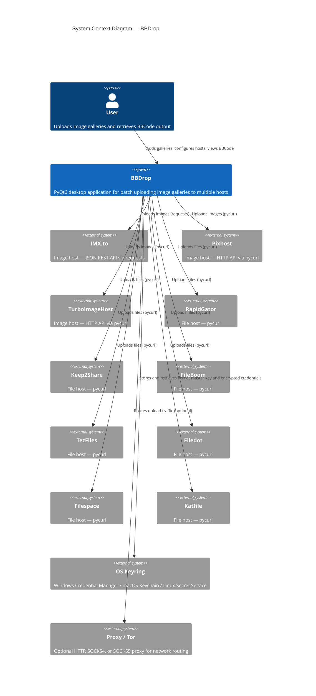

# System overview

This C4 Level 1 diagram shows BBDrop in its operating environment: the user who
interacts with it, the external services it uploads to, and the platform
services it depends on.

BBDrop communicates with three image hosts (IMX.to, Pixhost, TurboImageHost) and
seven file hosts (RapidGator, Keep2Share, FileBoom, TezFiles, Filedot,
Filespace, Katfile). IMX.to is accessed via `requests` over its JSON REST API;
all other hosts use `pycurl` for bandwidth tracking and connection control. An
optional proxy or Tor layer can route traffic through HTTP, SOCKS4, or SOCKS5
proxies.

The seven file hosts share a single `FileHostClient` implementation driven by
JSON configuration files (`assets/hosts/*.json`). Each host's upload flow,
authentication method, and response parsing are defined declaratively rather
than in host-specific code.
