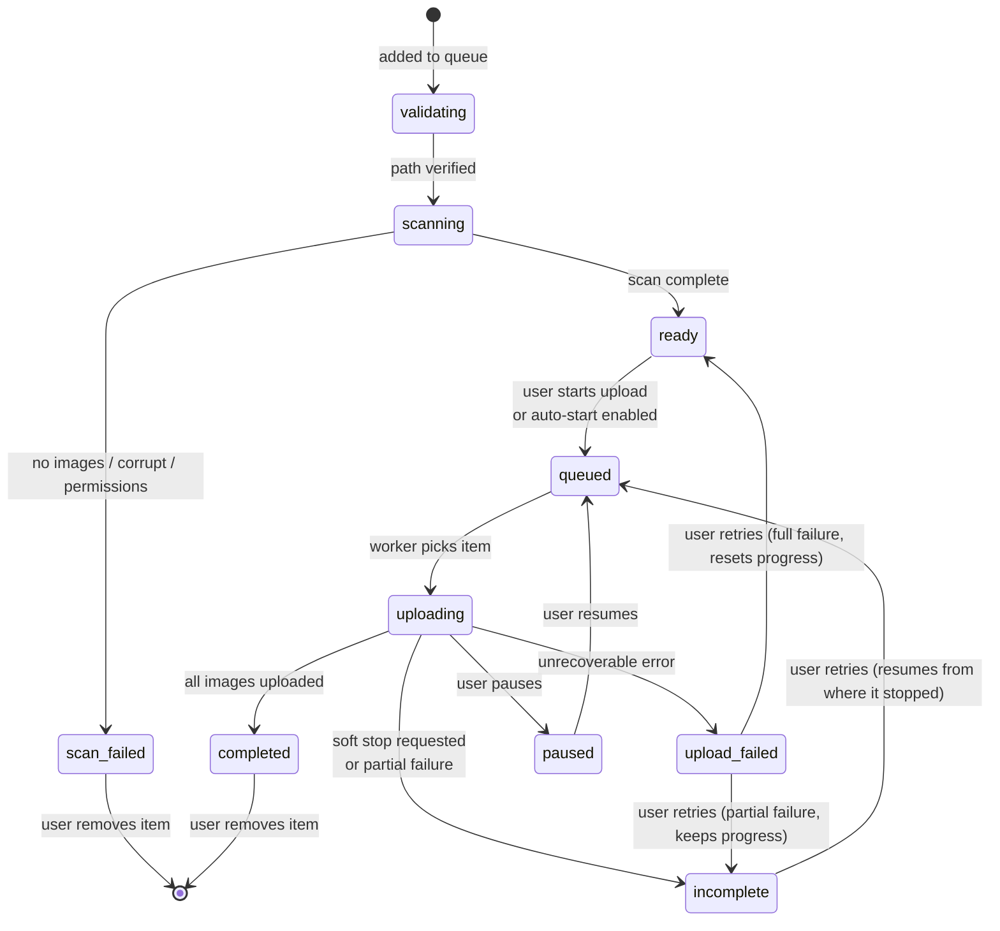

# Queue & Persistence

The gallery queue is the central data structure in BBDrop. Every gallery you add -- whether by drag-and-drop, folder browse, or archive extraction -- becomes an item in this queue. This document explains how the queue tracks state, persists across restarts, and coordinates between the GUI thread and background workers.

## GalleryQueueItem

Each gallery in the queue is represented by a `GalleryQueueItem` dataclass. This single object holds everything BBDrop knows about a gallery throughout its lifecycle:

- **Identity** -- `path` (filesystem path, used as the unique key), `name`, `db_id` (SQLite primary key)
- **Status tracking** -- `status`, `progress`, `error_message`
- **Upload state** -- `gallery_id`, `gallery_url`, `uploaded_images`, `uploaded_files` (set of filenames, for resume), `uploaded_bytes`
- **Scan metadata** -- `total_images`, `total_size`, image dimensions (avg/max/min width and height), `file_dimensions` dict, `scan_complete` flag
- **Configuration** -- `template_name`, `image_host_id`, `tab_name`, custom fields (`custom1`-`custom4`), external program results (`ext1`-`ext4`)
- **Cover photo** -- `cover_source_path`, `cover_host_id`, `cover_status`, `cover_result`

The dataclass uses default values and `field(default_factory=...)` for mutable types (sets, lists, dicts), so creating a new item requires only the `path` argument.

## Status lifecycle

A gallery progresses through a defined set of statuses. Each transition corresponds to a specific event in the upload pipeline.

The key statuses are:

| Status | Meaning |
|--------|---------|
| `validating` | Just added. Path existence is being checked. |
| `scanning` | Image files are being enumerated, validated, and measured for dimensions. |
| `ready` | Scan complete. Waiting for the user to start the upload (or auto-start). |
| `queued` | Marked for upload. Sitting in the worker queue waiting for the `UploadWorker` to pick it up. |
| `uploading` | The `UploadEngine` is actively uploading images. |
| `completed` | All images uploaded. Gallery URL and BBCode are available. |
| `paused` | User paused the upload. Can be resumed. |
| `incomplete` | Upload was interrupted (soft stop, or some images failed). Resume picks up from where it left off. |
| `upload_failed` | Upload failed with an unrecoverable error. Retry either resets (full failure) or resumes (partial failure). |
| `scan_failed` | The folder has no valid images, does not exist, or has permission issues. |

### Resume behavior

When a gallery moves to `incomplete` status, BBDrop preserves the `gallery_id`, `uploaded_files` set, and `uploaded_images` count. On retry, the `UploadEngine` receives the `already_uploaded` set and `existing_gallery_id`, skips files that are already on the host, and appends new uploads to the existing gallery. This avoids re-uploading images and creating duplicate galleries.

## SQLite persistence

The queue persists in a SQLite database at `~/.bbdrop/bbdrop.db`. The `QueueStore` class manages all database operations.

### Schema

The database has several tables, but two are central to the queue:

**`galleries`** -- One row per gallery in the queue. Stores all fields from `GalleryQueueItem` that need to survive a restart: path, name, status, timestamps, image counts, upload progress, gallery ID/URL, template, host ID, tab assignment, custom fields, and cover photo state.

**`images`** -- One row per uploaded image, linked to a gallery via `gallery_fk` foreign key. Stores filename, dimensions, size, upload timestamp, and URLs. This table enables resume: on restart, BBDrop rebuilds the `uploaded_files` set from the images table.

**`file_host_uploads`** -- Tracks file host upload state separately from image host uploads. Each row links a gallery to a specific file host (RapidGator, FileBoom, etc.) with its own status, progress, download URL, and error state. The `UNIQUE(gallery_fk, host_name, part_number)` constraint allows split archives (multiple parts per host).

### WAL mode

The database runs in WAL (Write-Ahead Logging) mode. In the default rollback journal mode, a writer blocks all readers. WAL mode reverses this: readers see a consistent snapshot while a writer appends to the WAL file. This matters because the GUI thread reads queue state frequently (for table rendering) while worker threads write progress updates.

WAL mode is configured at connection time alongside `PRAGMA synchronous=NORMAL` (flush on checkpoint, not every commit) and `PRAGMA busy_timeout=5000` (wait up to 5 seconds on lock contention before failing).

### Schema migrations

The database uses a versioned migration system. `_ensure_schema()` runs on first access and checks a stored `schema_version` value against the current `_SCHEMA_VERSION` constant. If the database is behind, `_run_migrations()` runs ALTER TABLE statements to add new columns and CREATE TABLE statements for new tables. Migrations are additive -- they never drop columns or tables -- so older versions of the data remain accessible.

A process-level set (`_schema_initialized_dbs`) tracks which database paths have been initialized, preventing repeated schema introspection across multiple `QueueStore` method calls within the same process.

## QueueManager

The `QueueManager` class bridges the `QueueStore` (database) and the GUI. It holds the in-memory `items` dictionary (keyed by normalized path), emits Qt signals on state changes, and coordinates thread-safe access.

### Thread coordination with QMutex

The GUI thread and worker threads both access the `items` dictionary. The `QueueManager` protects it with a `QMutex`:

- **Reading** (GUI table rendering, item lookups) -- Acquires the mutex, reads the item, releases the mutex.
- **Writing** (status updates, progress updates, scan results) -- Acquires the mutex, modifies the item, releases the mutex, then schedules a database save.

All status transitions follow this pattern:

1. Acquire mutex.
2. Update the in-memory item's status.
3. Update internal status counters (for efficient count queries).
4. Release mutex.
5. Schedule a debounced save to the database (or synchronous save for critical transitions).
6. Emit `status_changed` signal via `QTimer.singleShot(0, ...)` to avoid re-entrancy issues.

### Signal-based GUI updates

The `QueueManager` emits three signals:

| Signal | Parameters | Purpose |
|--------|-----------|---------|
| `status_changed` | path, old_status, new_status | Triggers GUI table row update and filter refresh |
| `scan_status_changed` | queue_size, items_pending | Updates the scan progress indicator |
| `queue_loaded` | (none) | Triggers full table refresh after loading from database |

Signals are emitted asynchronously (via `QTimer.singleShot(0, ...)`) so they are processed in the GUI thread's event loop, not in the worker thread that triggered the change. This prevents cross-thread GUI access, which Qt does not support.

### Debounced saves

Most status changes use debounced saves: the `QueueManager` schedules a database write after a short delay, and if another change arrives before the timer fires, the timer resets. This batches rapid-fire progress updates (which arrive every few hundred milliseconds during uploads) into fewer database writes.

Critical transitions -- `completed`, `failed`, and `upload_failed` -- bypass the debounce and save immediately. These represent final states where data loss on crash would mean losing the record of a finished upload.

### Batch mode

When adding many galleries at once (for example, dropping 100 folders), the `QueueManager` enters batch mode. In batch mode, individual saves are suppressed and changes accumulate in a set. When batch mode ends, a single bulk upsert writes all changes to the database. This avoids hundreds of individual INSERT statements and the associated lock contention.

## Scanning pipeline

When you add a gallery to the queue, it does not go directly to `ready` status. A sequential scan worker (a daemon thread with a `Queue`) processes galleries one at a time:

1. **Path validation** -- Checks that the path exists and is a directory.
2. **Image enumeration** -- Lists files matching image extensions (`.jpg`, `.jpeg`, `.png`, `.gif`).
3. **Image scanning** -- Validates each image, measures dimensions, and calculates total size.
4. **Cover detection** -- If cover photo detection is enabled, identifies cover images by filename pattern, dimensions, or file size.
5. **Status transition** -- Moves the item from `scanning` to `ready` (or `scan_failed` if validation fails).

Scanning is sequential (one gallery at a time) to avoid overwhelming the filesystem with parallel I/O, especially when adding many galleries simultaneously. The scan worker runs on a daemon thread, so it does not block the GUI.

## File host upload tracking

File host uploads (ZIP/7Z archives uploaded to RapidGator, FileBoom, etc.) are tracked in the `file_host_uploads` table, separate from the gallery's image host status. This separation exists because:

- A gallery can upload to multiple file hosts simultaneously.
- Each file host has its own status lifecycle (pending, uploading, completed, failed, cancelled).
- Split archives create multiple rows per host (one per part), linked by the `part_number` column.
- File host uploads can be retried independently of the image host upload.

The gallery's overall status reflects only the image host upload. File host status is displayed in separate columns in the GUI table.

---

Back to [Explanation](./index.md)
