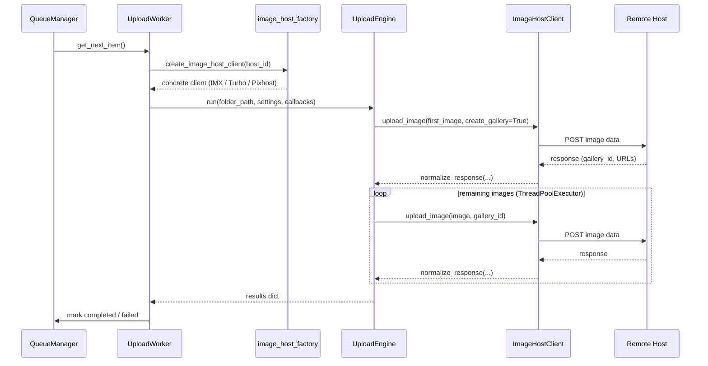

# Upload Pipeline

BBDrop uploads galleries to multiple image hosts through a single, host-agnostic pipeline. This document explains how a gallery moves from the queue to fully hosted images, and the design decisions that make multi-host support possible without host-specific branching in the core upload logic.

## Overview

When you start uploading a gallery, four layers collaborate to get images from disk to the remote host:

1. **UploadWorker** (QThread) -- pulls the next gallery from the queue and orchestrates the upload
2. **Image host factory** -- creates the correct client for the gallery's assigned host
3. **UploadEngine** -- runs the upload loop using only abstract methods, with no knowledge of which host it talks to
4. **Image host client** -- the concrete implementation that handles the HTTP details for one specific host



## The ABC pattern

The `ImageHostClient` abstract base class defines the contract that every image host must implement. It lives in `src/network/image_host_client.py` and declares these key methods:

- **`upload_image()`** -- Upload a single image, optionally creating a new gallery. Returns a normalized response dict.
- **`normalize_response()`** -- A static helper that builds the standard response shape. Concrete clients call this to ensure consistency.
- **`get_default_headers()`** -- Returns host-specific HTTP headers without the engine needing to know what they are.
- **`supports_gallery_rename()`** -- Indicates whether the host supports post-creation gallery renaming (only IMX does).
- **`sanitize_gallery_name()`** -- Applies host-specific naming rules. TurboImageHost limits names to 20 characters with restricted characters. Pixhost allows up to 100 characters. IMX strips control characters.
- **`get_gallery_url()`** / **`get_thumbnail_url()`** -- Build URLs from templates stored in the host configuration.

The ABC also accepts an `ImageHostConfig` object (loaded from JSON files in `assets/image_hosts/`) and an optional proxy entry. This keeps host configuration separate from host behavior.

### Why an ABC instead of duck typing

Python supports duck typing, and the engine could call any object with the right method names. The ABC exists for two reasons: it documents the contract explicitly, and it provides `normalize_response()` as a shared static method so each host does not need to rebuild the response dict structure independently.

## The factory pattern

The `create_image_host_client()` function in `src/network/image_host_factory.py` maps a host identifier string to the correct class:

| `host_id` | Client class | HTTP library |
|-----------|-------------|-------------|
| `imx` | `ImxToUploader` | requests |
| `turbo` | `TurboImageHostClient` | pycurl |
| `pixhost` | `PixhostClient` | pycurl |

The factory loads the host's `ImageHostConfig` from the configuration manager and passes it to the constructor. If the host identifier is not recognized or has no client implementation, the factory raises a `ValueError`.

The `UploadWorker` calls the factory once per host switch. If consecutive galleries use the same host, the worker reuses the existing client to preserve TCP connections and session state.

### Why two HTTP libraries

IMX.to uses the `requests` library because its API is straightforward JSON-based and does not require fine-grained upload progress tracking. TurboImageHost and Pixhost use `pycurl` because:

- **Bandwidth tracking**: pycurl exposes `XFERINFOFUNCTION`, a callback that fires during upload transmission with byte-level progress. This feeds the `AtomicCounter` for real-time speed display.
- **Connection reuse**: pycurl handles keep thread-local via `threading.local()`. Calling `curl.reset()` clears options but preserves the underlying TCP and TLS connection, avoiding repeated handshakes across images in a gallery.
- **Memory-based uploads**: pycurl supports `FORM_BUFFERPTR` to upload from memory. The client pre-reads each file before the POST so that multiple threads can upload truly concurrently, without serializing disk reads through Python's GIL.

## The UploadEngine

`UploadEngine` in `src/core/engine.py` is the host-agnostic upload loop shared by both the CLI and GUI. It receives an `ImageHostClient` instance and never inspects which concrete type it is. The engine handles:

### Gallery creation via first image

Rather than calling a separate "create gallery" API, the engine uploads the first image with `create_gallery=True`. The host's response includes the `gallery_id`, which the engine passes to all subsequent uploads. This avoids a separate authentication flow that some hosts require for gallery creation endpoints.

Before the first upload, the engine calls `clear_api_cookies()` on the client (if available) to prevent gallery ID reuse from a previous upload session.

### Parallel uploads with ThreadPoolExecutor

After the first image establishes the gallery, the engine uploads remaining images through a `ThreadPoolExecutor`. The pool size is controlled by the per-host `parallel_batch_size` setting (typically 4 concurrent uploads).

The pool uses an "as-completed" strategy: it primes the pool with `parallel_batch_size` initial tasks, then submits a new task each time one completes. This maintains steady concurrency without queuing all files as futures upfront.

### Soft stop

The engine checks a `should_soft_stop` callback between completions. When a soft stop is requested, the engine stops submitting new files but lets in-flight uploads finish. This prevents partial image uploads and wasted bandwidth.

### Automatic retries

Failed images are collected during the main loop and retried up to `max_retries` times (default 3). Retries use a fresh `ThreadPoolExecutor` with the same concurrency settings.

### Result ordering

Images complete in arbitrary order due to parallelism. After the upload loop, the engine sorts results by the original filesystem order so that BBCode output matches the folder's natural sort order.

## Normalized response contract

Every `upload_image()` call must return this dict structure:

```python
{
    "status": "success" | "error",
    "data": {
        "image_url": "https://...",     # Full-size image URL
        "thumb_url": "https://...",     # Thumbnail URL
        "gallery_id": "abc123",         # Host's gallery identifier
        "original_filename": "img.jpg", # Original filename on disk
        "bbcode": "[URL=...][IMG]...",  # Pre-built BBCode (optional)
    },
    "error": None | "error message"
}
```

The engine and workers consume this shape without host-specific branching. Hosts that do not provide all fields (for example, TurboImageHost does not return per-image URLs during upload) leave them empty. The engine calls `fetch_batch_results()` after the loop to backfill missing data from the result page.

## Bandwidth tracking

Real-time bandwidth display requires thread-safe byte counting across parallel uploads.

**AtomicCounter** wraps an integer with a `threading.Lock`. Two counters exist:

- **Global counter** -- accumulates bytes across all galleries for the session-level speed display.
- **Gallery counter** -- tracks bytes for the current gallery only. Reset between galleries.

**ByteCountingCallback** bridges pycurl's progress callback to the atomic counters. Each upload gets its own callback instance that tracks the last reported byte count and adds only the delta to the global counter. This avoids double-counting when pycurl reports cumulative progress.

A background polling thread reads the global counter every 200ms, calculates instantaneous KB/s, and emits a Qt signal to update the GUI speed display.

## Batch result fetching

Some hosts do not return complete image data during individual uploads. TurboImageHost returns only `{"success": true}` per image, then provides all URLs and BBCode on a result page after all uploads complete. Pixhost returns per-image URLs immediately but requires a finalization call to close the gallery.

The engine checks for a `fetch_batch_results()` method on the client after the upload loop. If present, it calls it once to retrieve the final data and merges it into the results by matching on `original_filename`.

## Gallery renaming

Gallery renaming is an IMX-specific concern. IMX creates galleries with auto-generated names, and a separate `RenameWorker` (QThread) handles renaming in the background to avoid blocking uploads. The engine checks `supports_gallery_rename()` on the client and only queues a rename if the host supports it. TurboImageHost and Pixhost set gallery names during creation, so they return `False` and no rename is attempted.

---

Back to [Explanation](./index.md)
